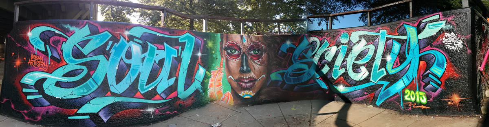

# Hi.

## I'm Thomas Wilburn, and this is my profile.

I'm a data journalist with over a decade of experience in building rich, interactive storytelling. Currently, I'm the Senior Data Editor for Chalkbeat. Before that, I was the senior news apps developer for NPR Visuals, and created cutting-edge stories and tools on the Interactives team at The Seattle Times.

I've also been a guest lecturer at The University of Washington, worked at ArenaNet (makers of Guild Wars 2) and Big Fish Games, ran the Multimedia Team at Congressional Quarterly, and produced educational audio and video for the World Bank Institute.

In my spare time, I'm a bassist, a b-boy, and a blogger. I like sandwiches, dogs, and lists with three items in them. 

## Work I'm proud of

* The [interactive project template](https://github.com/chalkbeat/interactive-template): A static site generator specifically designed for building data journalism projects, this sets up a scaffolding that pulls data from Google Docs and Sheets, as well as local JSON, CSV, and text files, and publishes to Amazon S3. I started this in 2014 at the Seattle Times, and have brought it with me ever since (including an iteration at [NPR](https://github.com/nprapps/interactive-template) that powered the 2020 election rig and the new Books We Love experience). **Why I like it:** I'm biased, but I think it's the perfect balance between refined scope and accessible power.
* [Dailygraphics Next](https://github.com/nprapps/dailygraphics-next): Where the interactive template provides a high ceiling, the Dailygraphics rig is intended for a tightly-defined scope - small, embedded graphics that are often (but not often) built in D3. This project was a successor to the original Dailygraphics project, providing a web-based UI and live reloads while editing. **Why I like it:** One of the largest projects I've built solo, with a clean architecture that's been easy to extend or refine.
* [Betty](https://github.com/nprapps/betty): A parser for [ArchieML](http://archieml.com), a lightweight document format that's often used in news projects. **Why I like it:** Where the original parser from the *New York Times* is built on regex, this implements a real three-stage parsing and assembly process, adding new hooks for key/value parsing and new syntax for multiline strings. See [this post](https://www.milezero.org/index.php/tech/open_source/call_me_al.html) on how it works, and how it improves on the original.
* [Tarot](https://github.com/Chalkbeat/powertoys/tree/main/tarot): By many standards a toy application, this social card image generator was a chance to put a new twist on an old challenge. You can read more about Tarot's architecture [on the Chalkbeat Dataviz blog](https://dataviz.chalkbeat.org/2022/03/14/tarot-architecture.html). **Why I like it:** I've long been a fan of custom elements, and Tarot ended up being a succinct encapsulation of how they can create a more expressive, almost whimsical design for web apps.
* [Web Components in Practice](https://thomaswilburn.github.io/wc-book) and [The Elegant Selection](https://thomaswilburn.github.io/viz-book/): Two digital books I wrote in an effort to distill some of my lessons-learned from a decade in visual journalism for the web. **Why I like it:** Like me, these books are messy, personal, and (I hope) helpful for those still finding their way in newsrooms that still struggle with digital publishing.
